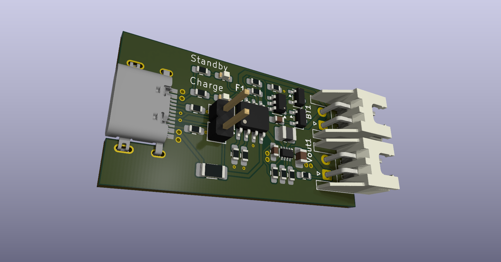

# Lion-Schutz

This is a hobby electronics project.

The PCB is designed to:
- generate a stable 3.3V rail,
- monitor overvoltage and undervoltage conditions,
- and charge a Li-Ion battery via USB-C.

## Used Chips

- TP4056
- DW01A
- TPS631000

## Current Status

This version has been ordered and has not been tested yet.

## Render

## Schematic

[Open schematic PDF](Schmetaic.pdf)
